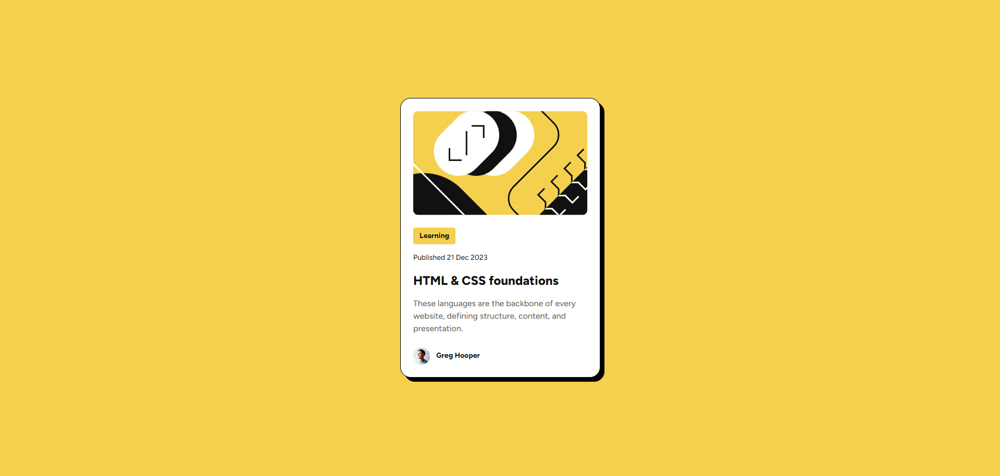
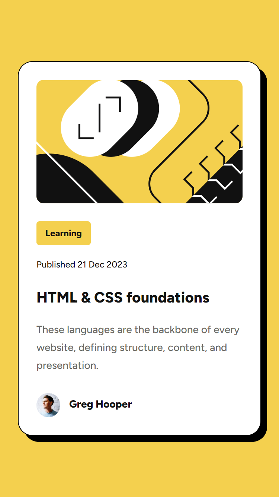

# Frontend Mentor - Blog preview card solution

This is a solution to the [Blog preview card challenge on Frontend Mentor](https://www.frontendmentor.io/challenges/blog-preview-card-ckPaj01IcS). Frontend Mentor challenges help you improve your coding skills by building realistic projects.

## Table of contents

- [Overview](#overview)
  - [The challenge](#the-challenge)
  - [Screenshots](#screenshots)
  - [Link](#link)
- [My process](#my-process)
  - [Built with](#built-with)
  - [What I learned](#what-i-learned)
  - [Useful resources](#useful-resources)
- [Author](#author)

## Overview

### The challenge

Users should be able to:

- See hover and focus states for all interactive elements on the page

### Screenshots

 

### Links

- [Solution URL](https://aguscorvo.github.io/blog-preview-card/)

## My process

### Built with

- Semantic HTML5 markup
- CSS custom properties
- Flexbox

### What I learned

How the clamp() function works.

### Useful resources

- [clamp() mdn web docs](https://developer.mozilla.org/en-US/docs/Web/CSS/clamp)

## Author

- Frontend Mentor - [@aguscorvo](https://www.frontendmentor.io/profile/aguscorvo)
- Twitter - [@agustina_corvo](https://twitter.com/agustina_corvo)
